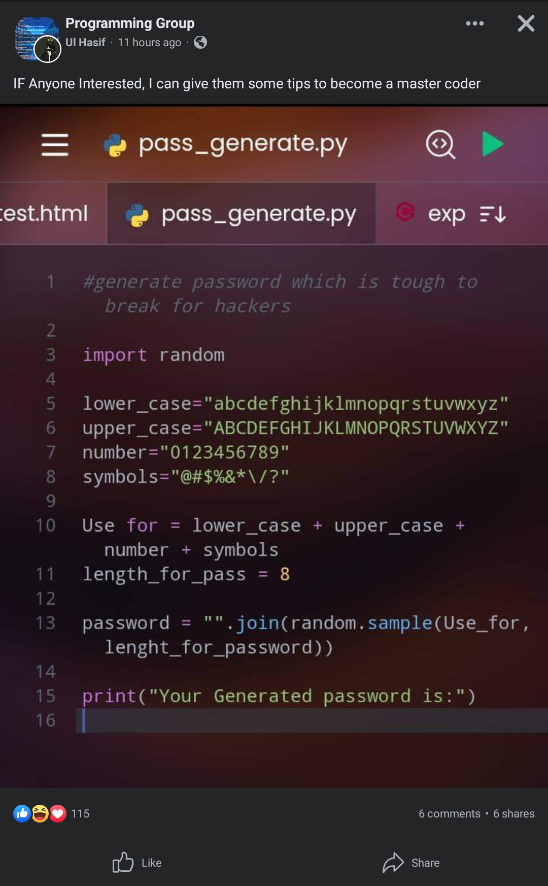

# pwn_the_meme - Overview
This is a fun, little, toy project that "pwns" the poor code seen in the following meme (source: https://www.reddit.com/r/ProgrammerHumor/comments/13ahhou/ah_yes_tough_to_break_for_hackers/ or alternatively: https://i.imgur.com/lefs1lW.png):

  
  <figure id="fig:1">
  </figure>

# Overview:
In this small project, I will try to take advantage of the main problem in this code which is that the psuedo-random function (PRF) and its seed are potentially compromised. My goals are to:
 - [ ] Provide a cleaned up, working version of the weak, memetic code
 - [ ] Pwn the password generator by trying to guess the seed for the PRF and then computing the password
 - [ ] Provide a proof of concept interface for guessing the password and logging into a basic Ubuntu VM.
 - [x] Try to justify why, using open source research on accounts, one may be able to guess the random seed state.
 
# Regarding that last point:
On python's main page for the documentation for random (https://docs.python.org/3/library/random.html), they say:

"Warning: The pseudo-random generators of this module should not be used for security purposes. For security or cryptographic uses, see the `secrets` module."

This is because, for the seed for the random function, "If *a* is omitted or `None`, the current system time is used". This means that if you knew roughly when an account was created, and assuming the user did not change their password, you can have a good range of time(s) to guess from for the seed. Twitter, for example, openly lists the month and year when the user joined on their main twitter page, respectively. If a person has a google account for another example, someone can go to their YouTube page, see if they post videos, and deduce a date range between YouTube's creation and their first uploaded video.

This is not to say that this attack would work, nor should it be used against these services. I would hope that larger websites would use more secure libraries for their cryptography. Rather, this is just meant to be a fun little project that gets one thinking about security and how our computers generate randomness...or really how they *dont'*!
